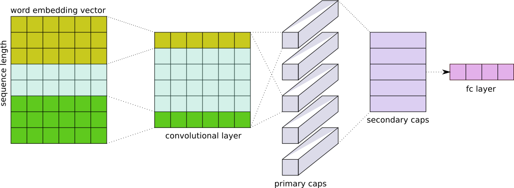

# TopicModelingWithCapsNet
Based on [Attention Based Aspect Extraction](https://github.com/ruidan/Unsupervised-Aspect-Extraction) 
[implementation](https://github.com/alexeyev/abae-pytorch) by 
[Anton Alekseev](https://github.com/alexeyev).

### Include

* Attention-Based Aspect Extraction model (ABAE) described in paper 
‘‘An unsupervised neural attention model for aspect extraction’’. 
[(pdf)](http://aclweb.org/anthology/P/P17/P17-1036.pdf)

* Capsule-Based Aspect Extraction model (CBAE) in which the attention mechanism is replaced by a 
capsule network with dynamic routing.


## Data 
You can find the pre-processed datasets and the pre-trained word embeddings in 
[[Download]](https://drive.google.com/open?id=1L4LRi3BWoCqJt5h45J2GIAW9eP_zjiNc). The zip file should be 
decompressed and put in the main folder.

## Requirements
* python 3.8
* nvidia GPU with cuda capability 3.5 and 6gb memory size

## Get started
```
$ pip install -r requirements.txt
$ jupyter notebook
```

## Cite
If you use the code, please consider citing original paper:
```
@InProceedings{he-EtAl:2017:Long2,
  author    = {He, Ruidan  and  Lee, Wee Sun  and  Ng, Hwee Tou  and  Dahlmeier, Daniel},
  title     = {An Unsupervised Neural Attention Model for Aspect Extraction},
  booktitle = {Proceedings of the 55th Annual Meeting of the Association for Computational Linguistics (Volume 1: Long Papers)},
  month     = {July},
  year      = {2017},
  address   = {Vancouver, Canada},
  publisher = {Association for Computational Linguistics}
}
```
